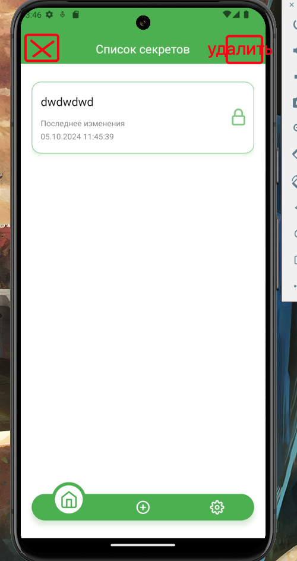

### Таски

### Удаление ключей всех

Сделать модалку из RN где показывать да нет, и надпись, 'Вы действительно хотите удалить все секреты', если да, то запрашивать биометрию или ключ. И вот если отменили биометрию и попали на модалку где вводим ключ

так же в этой модалке надо будет если все ок, удалять все секреты.И написать предупреждение. "Для безопасности использования, при изменении мастер ключа, все раннее сохраненные секреты будут удалены."

### Реализация выделения

При длительном нажатии на секрет, сделать режим выделения, то есть каждой карточке в правом верхнем углу сделать кружочки, которые потом будут заполняться галочкой, при этом элемент с которого началось действие сразу выделяем.

Для визуального эффекта можно сделать всей карточке scale.

Что бы отменить выбор, зададим кнопку с крестиком, где-то здесь. При нажатии убираем выделение со всех элементов

при нажатии на удаление, вызываем проверку биометрии, если её нет или если она не прошла, вызываем модалку проверки мастер ключа, если все ок, удаляем
